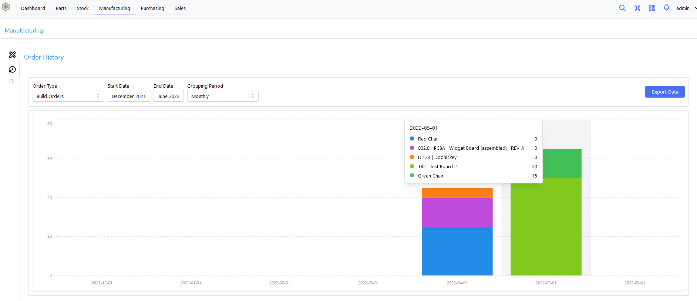
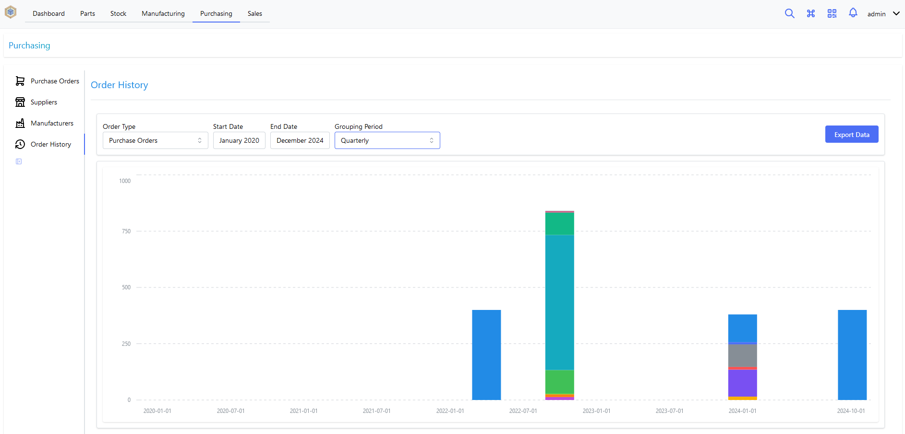
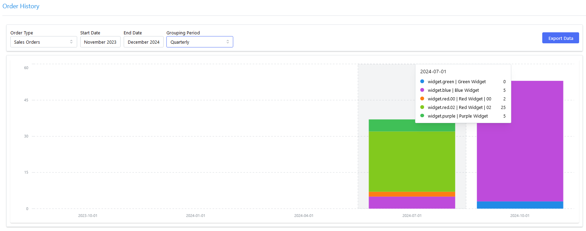
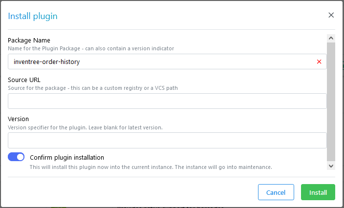
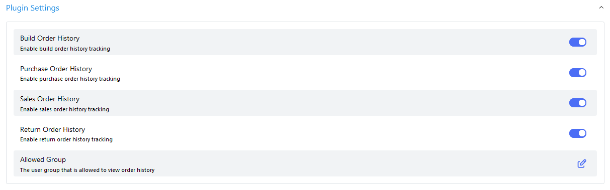
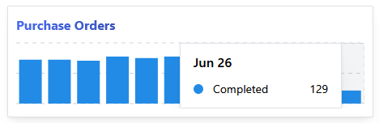

[](https://opensource.org/licenses/MIT)
[](https://pypi.org/project/inventree-order-history/)


# InvenTree Order History

An [InvenTree](https://inventree.org) plugin for generating historical ordering data.

This plugin provides a number of tools for generating historical ordering data, which can be displayed dynamically in the user interface, or exported to a file for further processing.

## Description

The *Order History* plugin provides historical order information in a number of different contexts throughout the user interface:

| Context | Screenshot |
| --- | --- |
| All Build Orders |  |
| All Purchase Orders |  |
| Sales Orders for a specific Part |  |

## Installation

### Via User Interface

The simplest way to install this plugin is from the InvenTree plugin interface. Enter the plugin name (`inventree-order-history`) and click the `Install` button:



### Via Pip

Alternatively, the plugin can be installed manually from the command line via `pip`:

```bash
pip install -U inventree-order-history
```

*Note: After the plugin is installed, it must be activated via the InvenTree plugin interface.*

## Configuration

The plugin can be configured via the InvenTree plugin interface. The following settings are available:

| Setting | Description |
| --- | --- |
| Build Order History | Enable display of build order history information |
| Purchase Order History | Enable display of purchase order history information |
| Sales Order History | Enable display of sales order history information |
| Return Order History | Enable display of return order history information |
| Allowed Group | Specify a group which is allowed to view order history information. Leave blank to allow all users to view order history information. |



## Dashboard Widgets

The plugin provides four custom dashboard widgets, each displaying a bar chart of completed orders per month for the rolling 12-month window. Widgets are added from the InvenTree dashboard by clicking *Add Widget*:

| Widget | Description |
| --- | --- |
| Build Order History | Completed build orders per month |
| Purchase Order History | Completed purchase orders per month |
| Sales Order History | Completed sales orders per month |
| Return Order History | Completed return orders per month |

Each widget only appears if the corresponding order type is enabled in the plugin settings (e.g. *Build Order History* must be enabled for the build order widget to be available). If a *User Group* is configured, only members of that group will see any of the widgets.

Months with no completed orders are shown as zero rather than being omitted, giving a consistent 12-bar view.



## Contributing

### Backend

Backend code is written in Python, and is located in the `order_history` directory.

### Frontend

Frontend code is written in JavaScript, and is located in the `frontend` directory. Read the [frontend README](frontend/README.md) for more information.
